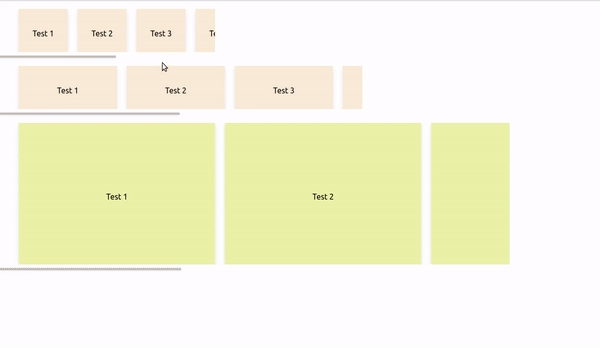

<h1 align="center">
  
  <h1 align="center">react-horizontal-scroll-grid</h1>
</h1>

<h4 align="center">A simple UI component for <a href="https://reactjs.org/" target="_blank">React</a></h4>

[](https//npmjs.com/package/react-horizontal-scroll-grid)
[](https://github.com/keyurparalkar/react-horizontal-scroll-grid/blob/main/License.md)

```
<HScrollGrid gridWidth={400} gridHeight={100} cardWidth={100} backgroundColor="antiquewhite">
    <li>Test</li>
    <li>Test</li>
    <li>Test</li>
    <li>Test</li>
    <li>Test</li>
</HScrollGrid>
```
### Demo


### Changelog
|Version     | Compatibility|
|------------|--------------|
|0.1.3       | React 16.3+  |

### Technical Documentation

* [Installing](#Installing)
* [Exports](#Exports)

#### Installing
```
npm install react-horizontal-scroll-grid
```

#### Exports
The `HScrollGrid` component can exported as follows:
```
import HScrollGrid from "react-horizontal-scroll-grid"
```

### HScrollGrid
A `HScrollGrid` is a simple UI Wrapper Component which helps you to display in your `<li>` items in horizontal scroll view. It is completely css based implementation. The count of child elements is directly computed at `componentDidMount` stage and set using css variables.

#### HScrollGrid Props
|Prop Name     | Required |Default value | Description| 
|------------|--------------|----------|---------|
|gridWidth       | Yes| `null` | Should be passed as `number`
|gridHeight | Yes | `null`| Should be passed as `number` *
|cardWidth| Yes | `null`| Should be passed as `number`
|backgroundColor |No| `transparent`| Should be passed `String`

**NOTE**
* `gridWidth`, `gridHeight`,`cardWidth` should be passed in as `number` since they are used as pixels in css.
* Please be aware that by providing the value of `gridHeight` you are also setting the height of each child element to `gridHeight` i.e. Grid's `gridHeight` = card's `gridHeight` 

#### Usage
```
import React from 'react';
import HScrollGrid from 'react-horizontal-scroll-grid';

const Example = () => {
    const keys = [1, 2, 3, 4, 5, 6];
    const cards = keys.map(elem => <li key={elem}> Test </li>);
    return (
        <>
            <HScrollGrid
                gridWidth={400}
                gridHeight={100}
                cardWidth={100}
                backgroundColor="antiquewhite"
            >
                {cards}
            </HScrollGrid>

            <HScrollGrid
                gridWidth={700}
                gridHeight={100}
                cardWidth={200}
                backgroundColor="antiquewhite"
            >
                {cards}
            </HScrollGrid>

            <HScrollGrid
                gridWidth={1000}
                gridHeight={300}
                cardWidth={400}
                backgroundColor="#ecf2a7"
            >
                {cards}
            </HScrollGrid>
        </>
    )
};

export default Example;
```
## Built with
- [React](https://reactjs.org/)
- [Jest](https://jestjs.io/en/)

## Features
- Provides a UI wrapper to wrap child elements in horizontal scrolling view.
- Dynamic child element count computation using css variables.
- Easy-to-use


## You can reach out 😊😊

Feel free to contact me about the problems. I will try to help as much as I can 😉

[](https://www.linkedin.com/in/keyur-paralkar-494415107/)
[](mailto:keur.plkar@gmail.com)
[](https://twitter.com/keurplkar)
[](https://github.com/keyurparalkar/)

## License
This project is licensed under the MIT License - see the [LICENSE](LICENSE) file for details

